# Small Business Compliance Assistant

**A practical workspace for small businesses to understand compliance, apply through official portals, and keep their documents current.**

The assistant combines a business profile, a reviewed compliance catalog, secure document storage, and expiry tracking. Government applications are always completed by the user on the official government website; this app does not submit them.

## The Workflow

```mermaid
flowchart LR
    A[Public homepage] --> B[Sign up or log in]
    B --> C[AI Assistant]
    C --> D[Save business profile]
    D --> E[Matched requirements]
    E --> F[Requirement details]
    F --> G[Official application portal]
    G --> H[User applies independently]
    H --> I[I Applied Successfully]
    I --> J[Upload issued document]
    J --> K[Documents vault]
    K --> L[Expiry deadlines]
```



## Features

- Email-based login and signup with a required username.
- Signup and login take users directly to the AI Assistant; guests see the public homepage.
- Business profile collection for business type, activity, location, and employee count.
- Requirement matching from a curated compliance catalog.
- Requirement details for why a rule may apply, documents to prepare, application steps, official sources, and application portals.
- External government portal links; users submit applications themselves.
- Requirement-linked document uploads with optional issue and expiry dates.
- Owner-only document viewing, editing, and downloads.
- Deadline groups for expired or expiring-today documents and documents expiring within the next 10 days.
- Gemini-powered plain-language answers with reminders to verify legal details through official sources.

## Technology

- Python 3.12 or newer
- Django 6.1
- SQLite by default
- Google Gen AI SDK for Gemini responses
- Django templates, CSS, and JavaScript

## Quick Start

### Windows PowerShell

```powershell
py -3 -m venv .venv
.\.venv\Scripts\Activate.ps1
python -m pip install --upgrade pip
pip install -r requirements.txt
Copy-Item .env.example .env
python manage.py migrate
python manage.py createsuperuser
python manage.py runserver
```

Open `http://127.0.0.1:8000/` in your browser.

### macOS or Linux

```bash
python3 -m venv .venv
source .venv/bin/activate
python -m pip install --upgrade pip
pip install -r requirements.txt
cp .env.example .env
python manage.py migrate
python manage.py createsuperuser
python manage.py runserver
```

## Configuration

Set environment variables in the local `.env` file:

| Variable | Purpose | Default |
| --- | --- | --- |
| `SECRET_KEY` | Django signing key; use a private value outside local development | Development-only key |
| `DEBUG` | Enables Django debug mode | `True` |
| `ALLOWED_HOSTS` | Comma-separated host names | `localhost,127.0.0.1` |
| `GEMINI_API_KEY` | API key for Gemini-backed answers | Empty; AI answers will be unavailable |
| `GEMINI_MODEL` | Gemini model name | `gemini-2.5-flash` |

Keep `.env` private. Do not commit API keys or production secrets.

## Curated Requirements

Requirement matching uses records in the `ComplianceRequirement` catalog. The catalog is intentionally maintained separately from AI-generated text so legal requirements and portal links are not invented.

1. Start the app and sign in with a Django admin account.
2. Open `http://127.0.0.1:8000/admin/`.
3. Add reviewed entries under **Compliance requirements** with their business type, jurisdiction, summary, application guidance, official source URL, and official portal URL.
4. Users with a matching business profile will see those requirements in the AI Assistant.

Only add requirements and links that have been verified for the target jurisdiction. A blank catalog correctly produces no matched requirements.

## Documents and Deadlines

Uploaded files are associated with their owner and stored under `media/private_documents/`. Downloads and edits are restricted to the document owner. Issue date and expiry date are optional; leave expiry blank when a document does not expire.

The Deadlines page displays:

- **Expired or expiring today** for dates on or before today, with expired items labeled separately.
- **Expiring within 10 days** for dates from tomorrow through the next 10 days.
- No documents without an expiry date.

## Run Tests

```powershell
python manage.py test
```

Check for model changes that need migrations:

```powershell
python manage.py makemigrations --check --dry-run
```

## Project Layout

| Path | Responsibility |
| --- | --- |
| `accounts/` | Email authentication and account creation |
| `ai_assistant/` | Business profile workflow and AI responses |
| `businesses/` | User business profiles |
| `compliance/` | Curated requirements and application tracking |
| `documents/` | Private uploads, metadata, edits, and downloads |
| `deadlines/` | Expired and upcoming document expiry views |
| `core/` | Public homepage and dashboard |
| `templates/` | Django HTML templates |
| `static/` | CSS and JavaScript assets |

## Important Notes

- Compliance guidance is informational, not legal advice. Confirm requirements with the relevant government authority.
- The user completes and submits every government application on the official portal.
- Database schema changes are tracked in Django migrations. Run `python manage.py migrate` after updating the project.
- Uploaded documents may contain sensitive information. Use secure storage, HTTPS, backups, and appropriate access controls in production.