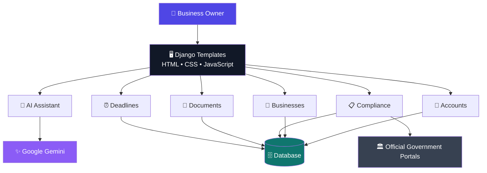

# 🏢 Small Business Compliance Assistant

<p align="center">
  
  
  
  
</p>

<p align="center">

### 📋 Understand Compliance.  
### 🔐 Protect Documents.  
### ⏰ Never Miss a Deadline.

A modern Django-based workspace designed to help small businesses understand compliance requirements, access official government portals, organize important documents, and track expiry dates.

</p>

<p align="center">
  <a href="#-features">Features</a> •
  <a href="#-how-it-works">How It Works</a> •
  <a href="#-tech-stack">Tech Stack</a> •
  <a href="#-installation">Installation</a> •
  <a href="#-security">Security</a>
</p>

---

## 🌐 The Problem

Running a small business can involve a surprising amount of paperwork.

Licenses. Registrations. Certificates. Renewals. Government portals. Expiry dates.

And the hardest part isn't always completing the application.

Sometimes it's simply knowing:

```text
What applies to my business?
        ↓
What documents do I need?
        ↓
Where do I apply?
        ↓
What happens after approval?
        ↓
When does my document expire?
```

### 💡 The solution

**Small Business Compliance Assistant** brings these pieces into one organized workspace.

> **Discover → Understand → Apply → Store → Track**

---

# ✨ Features

<table>
<tr>

<td align="center" width="33%">

### 🤖
## AI Assistant

Ask compliance questions in plain language and get easy-to-understand answers powered by Gemini.

</td>

<td align="center" width="33%">

### 🏢
## Business Profile

Tell the application about your business so relevant requirements can be identified.

</td>

<td align="center" width="33%">

### 📋
## Compliance Matching

Match business information against a curated compliance catalog.

</td>

</tr>

<tr>

<td align="center" width="33%">

### 🔗
## Official Portals

Open verified government portals and complete applications independently.

</td>

<td align="center" width="33%">

### 🔐
## Document Vault

Store requirement-related documents with owner-only access.

</td>

<td align="center" width="33%">

### ⏰
## Deadline Tracking

See expired documents and documents approaching their expiry date.

</td>

</tr>
</table>

---

# 🪄 How It Works

```mermaid
flowchart LR

    A["🌐<br/>Homepage"] --> B["🔐<br/>Sign Up"]
    B --> C["🏢<br/>Business Profile"]
    C --> D["📋<br/>Requirements"]
    D --> E["📖<br/>Understand"]
    E --> F["🔗<br/>Official Portal"]
    F --> G["👤<br/>Apply"]
    G --> H["📄<br/>Upload Document"]
    H --> I["⏰<br/>Track Expiry"]

    style A fill:#111827,stroke:#6366f1,color:#fff
    style B fill:#111827,stroke:#6366f1,color:#fff
    style C fill:#111827,stroke:#6366f1,color:#fff
    style D fill:#111827,stroke:#6366f1,color:#fff
    style E fill:#111827,stroke:#6366f1,color:#fff
    style F fill:#111827,stroke:#6366f1,color:#fff
    style G fill:#111827,stroke:#6366f1,color:#fff
    style H fill:#111827,stroke:#6366f1,color:#fff
    style I fill:#111827,stroke:#6366f1,color:#fff
```



### 🧭 The journey

**01 → Create your business profile**

Tell the system what type of business you operate, what you do, where you operate, and other relevant information.

**02 → Discover requirements**

The application checks the curated compliance catalog and identifies potentially relevant requirements.

**03 → Understand**

Read the requirement summary, documents needed, application guidance, and official sources.

**04 → Apply**

Open the official government portal and complete the application yourself.

**05 → Store**

Once a document is issued, upload it to your private document vault.

**06 → Track**

Monitor expiry dates and upcoming deadlines.

---

# 🤖 AI + Verified Data

One of the most important architectural decisions is:

> **AI explains. Verified data defines.**

The AI should not invent government requirements or official application URLs.

Instead:

```text
                  ┌──────────────────────┐
                  │  Curated Compliance  │
                  │       Catalog        │
                  └──────────┬───────────┘
                             │
                             ▼
                    Relevant Requirements
                             │
                             ▼
                       ┌────────────┐
                       │    User    │
                       └─────┬──────┘
                             │
                             ▼
                     🤖 Gemini Assistant
                             │
                             ▼
                    Plain-language Help
```

The compliance catalog contains reviewed information such as:

- Business type
- Jurisdiction
- Requirement summary
- Required documents
- Application guidance
- Official source URL
- Official application portal URL

This separation helps keep factual compliance information independent from AI-generated explanations.

---

# 🔐 Security First

Compliance documents can contain sensitive business information.

Security is therefore part of the product architecture, not an afterthought.

### Current protections

```text
🔐 Authentication
       │
       ▼
👤 Owner verification
       │
       ▼
📄 Owner-only documents
       │
       ├── View
       ├── Edit
       └── Download
```

### Security considerations

- Django authentication
- Owner-only document access
- Environment-based secrets
- `.env` excluded from Git
- Private document storage
- CSRF protection
- Production HTTPS requirement
- Secure cookies
- File validation
- File-size restrictions
- Production database
- Secure backups
- Dependency updates

---

# ⏰ Deadline Intelligence

Documents are automatically grouped by expiry.

| Status | Meaning |
|---|---|
| 🔴 **Expired** | Expiry date has passed |
| 🟠 **Today** | Expires today |
| 🟡 **Upcoming** | Expires within the next 10 days |
| ⚪ **No expiry** | No expiry date was provided |

The goal is simple:

> **Open the dashboard and immediately know what needs attention.**

---

# 🎨 UI / Design Direction

The interface follows a modern SaaS-style design philosophy.

### 🌙 Dark Mode

A deep dark workspace with subtle gradients and glowing accents.

### ☀️ Light Mode

A clean, bright interface with high readability.

### ✨ Motion

Animations should be subtle and purposeful:

```text
Hover
  ↓
Slight elevation
  ↓
Soft shadow
  ↓
Smooth transition
```

### 🧊 3D-inspired UI

The application can use lightweight 3D-style visual elements such as:

- Floating document cards
- Layered dashboard panels
- 3D security/shield illustrations
- Floating compliance icons
- Depth-based cards
- Soft glassmorphism

The goal is **premium**, not "every button is spinning in 3D." 😄

---

# 🏗️ Architecture



---

# 🛠️ Tech Stack

<table>
<tr>
<td><b>Backend</b></td>
<td>Python + Django 6.1</td>
</tr>

<tr>
<td><b>Frontend</b></td>
<td>Django Templates + HTML + CSS + JavaScript</td>
</tr>

<tr>
<td><b>AI</b></td>
<td>Google Gen AI SDK + Gemini</td>
</tr>

<tr>
<td><b>Database</b></td>
<td>SQLite for development</td>
</tr>

<tr>
<td><b>Authentication</b></td>
<td>Django Authentication</td>
</tr>

<tr>
<td><b>Documents</b></td>
<td>Django file handling + private storage</td>
</tr>
</table>

---

# 📁 Project Structure

```text
📦 small-business-compliance-assistant
│
├── 🔐 accounts/
│   └── Authentication & account creation
│
├── 🤖 ai_assistant/
│   └── AI workflow & responses
│
├── 🏢 businesses/
│   └── Business profiles
│
├── 📋 compliance/
│   └── Compliance catalog
│
├── 📄 documents/
│   └── Private document management
│
├── ⏰ deadlines/
│   └── Expiry tracking
│
├── 🌐 core/
│   └── Homepage & dashboard
│
├── 🎨 templates/
│   └── HTML templates
│
├── ⚡ static/
│   └── CSS & JavaScript
│
├── 📁 media/
│   └── Uploaded documents
│
├── ⚙️ manage.py
├── 📦 requirements.txt
├── 🔑 .env.example
├── 🚫 .gitignore
└── 📖 README.md
```

---

# 🚀 Installation

## Windows

```powershell
# Clone
git clone https://github.com/your-username/your-repository.git

# Enter project
cd your-repository

# Create virtual environment
py -3 -m venv .venv

# Activate
.\.venv\Scripts\Activate.ps1

# Upgrade pip
python -m pip install --upgrade pip

# Install dependencies
pip install -r requirements.txt

# Create environment file
Copy-Item .env.example .env

# Database
python manage.py migrate

# Admin