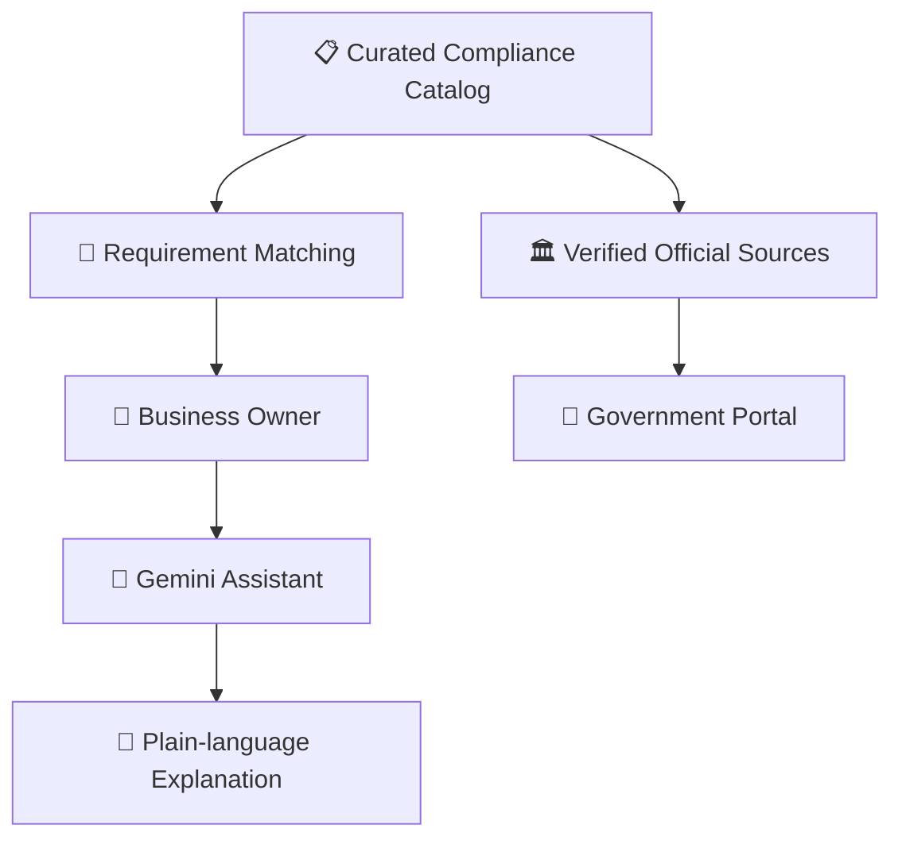
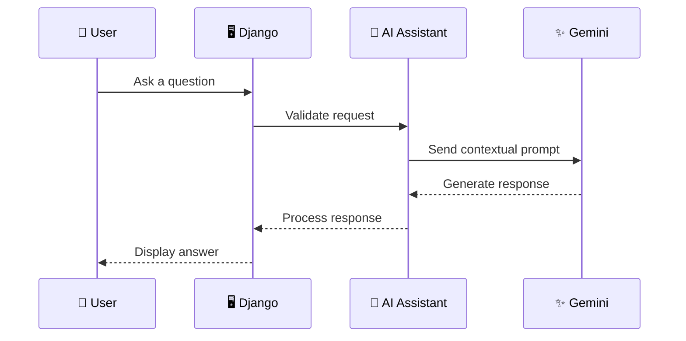
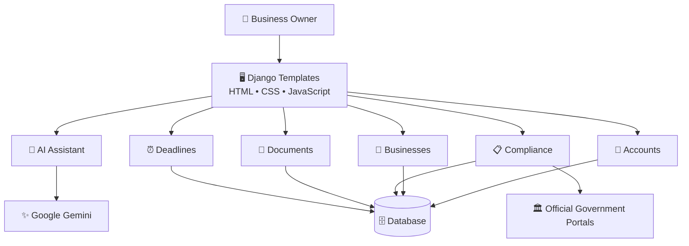

<div align="center">

<svg width="100%" height="260" viewBox="0 0 1200 260" xmlns="http://www.w3.org/2000/svg">
  <defs>
    <linearGradient id="heroGradient" x1="0%" y1="0%" x2="100%" y2="100%">
      <stop offset="0%" stop-color="#0f172a"/>
      <stop offset="50%" stop-color="#172554"/>
      <stop offset="100%" stop-color="#312e81"/>
    </linearGradient>

    <linearGradient id="glowGradient" x1="0%" y1="0%" x2="100%" y2="0%">
      <stop offset="0%" stop-color="#38bdf8"/>
      <stop offset="50%" stop-color="#818cf8"/>
      <stop offset="100%" stop-color="#c084fc"/>
    </linearGradient>

    <filter id="glow">
      <feGaussianBlur stdDeviation="5" result="blur"/>
      <feMerge>
        <feMergeNode in="blur"/>
        <feMergeNode in="SourceGraphic"/>
      </feMerge>
    </filter>

    <filter id="shadow">
      <feDropShadow dx="0" dy="12" stdDeviation="12" flood-opacity="0.35"/>
    </filter>
  </defs>

  <rect width="1200" height="260" rx="24" fill="url(#heroGradient)"/>

  <circle cx="1050" cy="55" r="90" fill="#6366f1" opacity="0.10"/>
  <circle cx="1100" cy="190" r="120" fill="#38bdf8" opacity="0.08"/>
  <circle cx="80" cy="210" r="100" fill="#8b5cf6" opacity="0.08"/>

  <g opacity="0.35">
    <path d="M0 220 Q300 150 600 220 T1200 180" fill="none" stroke="#60a5fa" stroke-width="1"/>
    <path d="M0 235 Q300 165 600 235 T1200 195" fill="none" stroke="#a78bfa" stroke-width="1"/>
  </g>

  <g transform="translate(870 55)" filter="url(#shadow)">
    <rect x="0" y="15" width="190" height="130" rx="16" fill="#111827" stroke="#6366f1" stroke-width="2"/>
    <rect x="18" y="35" width="100" height="10" rx="5" fill="#38bdf8" opacity="0.8"/>
    <rect x="18" y="58" width="145" height="8" rx="4" fill="#475569"/>
    <rect x="18" y="78" width="120" height="8" rx="4" fill="#475569"/>
    <rect x="18" y="98" width="90" height="8" rx="4" fill="#475569"/>

    <circle cx="158" cy="108" r="20" fill="#312e81" stroke="#818cf8" stroke-width="2"/>
    <path d="M149 108 L156 115 L169 99" fill="none" stroke="#67e8f9" stroke-width="4" stroke-linecap="round"/>

    <animateTransform
      attributeName="transform"
      type="translate"
      values="870 55;870 48;870 55"
      dur="4s"
      repeatCount="indefinite"/>
  </g>

  <g filter="url(#glow)">
    <text x="80" y="92"
          font-family="Arial, Helvetica, sans-serif"
          font-size="44"
          font-weight="700"
          fill="white">
      Small Business
    </text>

    <text x="80" y="142"
          font-family="Arial, Helvetica, sans-serif"
          font-size="44"
          font-weight="700"
          fill="url(#glowGradient)">
      Compliance Assistant
    </text>
  </g>

  <text x="82" y="180"
        font-family="Arial, Helvetica, sans-serif"
        font-size="18"
        fill="#cbd5e1">
    Understand • Apply • Organize • Track
  </text>

  <rect x="82" y="202" width="260" height="3" rx="2" fill="url(#glowGradient)">
    <animate attributeName="width"
             values="100;260;100"
             dur="4s"
             repeatCount="indefinite"/>
  </rect>
</svg>

<br>

# 🏢 Small Business Compliance Assistant

### A modern workspace for understanding compliance, managing documents, and staying ahead of deadlines.

<br>


<br>


</div>

---

## 💡 What is it?

Running a small business can involve licenses, registrations, certificates, renewals, documents, government portals, and deadlines.

The **Small Business Compliance Assistant** brings these pieces together into one organized workspace.

Instead of asking:

> **"What applies to my business?"**

> **"What documents do I need?"**

> **"Where do I apply?"**

> **"When does this document expire?"**

the application creates a structured workflow:

```text
       🏢 Business
            │
            ▼
    📋 Find Requirements
            │
            ▼
     📖 Understand Them
            │
            ▼
   🏛️ Visit Official Portal
            │
            ▼
      👤 Apply Yourself
            │
            ▼
       📄 Store Document
            │
            ▼
       ⏰ Track Expiry
```

> ⚠️ **Important:** The application does not submit government applications on behalf of users. Users complete applications themselves on the relevant official government portal.

---

# ✨ Features

<div align="center">

| 🤖 AI Assistant | 🏢 Business Profile | 📋 Compliance Matching |
|:---:|:---:|:---:|
| Plain-language compliance explanations powered by Gemini | Business type, activity, location & employee information | Match businesses with curated requirements |

| 🔗 Official Portals | 🔐 Document Vault | ⏰ Deadline Tracking |
|:---:|:---:|:---:|
| Access verified government application portals | Owner-only document management | Expired & upcoming document alerts |

</div>

### 🤖 AI Assistant

Ask compliance-related questions using natural language.

- Gemini-powered responses
- Plain-language explanations
- Business context
- Guidance toward official sources
- Reminders to verify important legal information

### 🏢 Business Profile

Create a profile describing your business.

- Business type
- Business activity
- Location
- Employee count
- Other matching information

### 📋 Compliance Matching

Requirements come from a **curated compliance catalog**, rather than being invented by the AI.

Each requirement can contain:

- Requirement summary
- Applicable business type
- Jurisdiction
- Required documents
- Application guidance
- Official source
- Official application portal

### 🔗 Official Government Portals

The application provides links to verified official portals.

The user remains in control of the application process.

### 🔐 Private Document Vault

Documents can be linked to requirements and managed privately.

- Owner-only access
- Upload
- Edit metadata
- Download
- Issue date
- Expiry date

### ⏰ Deadline Tracking

The dashboard separates documents into useful groups:

```text
🔴 EXPIRED
    ↓
🟠 EXPIRING TODAY
    ↓
🟡 EXPIRING WITHIN 10 DAYS
```

Documents without an expiry date are excluded from deadline groups.

---

# 🧭 How It Works

```mermaid
flowchart LR

    A["🌐<br/>Public Homepage"]
    B["🔐<br/>Sign Up / Login"]
    C["🏢<br/>Business Profile"]
    D["📋<br/>Matched Requirements"]
    E["📖<br/>Requirement Details"]
    F["🏛️<br/>Official Portal"]
    G["👤<br/>User Applies"]
    H["📄<br/>Upload Document"]
    I["🔐<br/>Document Vault"]
    J["⏰<br/>Expiry Tracking"]

    A --> B
    B --> C
    C --> D
    D --> E
    E --> F
    F --> G
    G --> H
    H --> I
    I --> J
```



---

# 🧠 The Core Idea

The most important architectural principle is:

<div align="center">

### **AI explains. Verified data defines.**

</div>

The AI should not decide what a government requirement is or invent an application URL.

Instead:



This separation helps keep factual compliance information independent from AI-generated explanations.

---

# 🤖 Gemini AI

The application uses the **Google Gen AI SDK** to communicate with Gemini.



### AI is intended to help with:

- Understanding compliance concepts
- Simplifying complicated language
- Explaining requirements
- Answering general questions
- Guiding users toward official sources

### AI is not a replacement for:

- Government authorities
- Official regulations
- Legal professionals
- Official application portals

---

# 🛡️ Security

Compliance documents may contain sensitive business information.

Security is therefore treated as a core part of the application.

### 🔐 Current protections

```text
Authentication
      │
      ▼
Owner Verification
      │
      ▼
Private Documents
      │
      ├── View
      ├── Edit
      └── Download
```

### Production security checklist

- [ ] `DEBUG=False`
- [ ] Strong production `SECRET_KEY`
- [ ] HTTPS
- [ ] Secure cookies
- [ ] Restricted `ALLOWED_HOSTS`
- [ ] File validation
- [ ] File-size limits
- [ ] Secure document storage
- [ ] Production database
- [ ] Secure backups
- [ ] Dependency updates
- [ ] Rate limiting
- [ ] Logging & monitoring

---

# 🧊 UI & Design

The project is designed around a modern SaaS-style interface.

### 🌙 Dark Mode

Deep dark backgrounds with subtle blue/purple accents.

### ☀️ Light Mode

Clean surfaces with strong readability.

### ✨ Motion

Animations should improve usability rather than distract from it.

Examples:

```text
Card Hover
     ↓
Small Lift
     ↓
Soft Shadow
     ↓
Smooth Transition
```

### 🧊 3D-inspired Elements

The interface can use lightweight depth effects such as:

- Floating document cards
- Layered dashboard panels
- 3D-style security illustrations
- Floating compliance icons
- Glassmorphism
- Soft gradients
- Depth-based cards

The visual goal is:

> **Modern and premium, not visually overloaded.**

---

# 🏗️ Architecture



---

# 🛠️ Tech Stack

<div align="center">

| Layer | Technology |
|---|---|
| 🐍 Language | Python 3.12+ |
| 🎯 Framework | Django 6.1 |
| 🤖 AI | Google Gemini |
| 🔌 AI SDK | Google Gen AI SDK |
| 🗄️ Database | SQLite |
| 🎨 Frontend | HTML + CSS + JavaScript |
| 🔐 Authentication | Django Authentication |
| 📁 Storage | Django File Handling |

</div>

---

# 📁 Project Structure

```text
📦 small-business-compliance-assistant
│
├── 🔐 accounts/
│   └── Authentication & account creation
│
├── 🤖 ai_assistant/
│   └── Business profile workflow & AI responses
│
├── 🏢 businesses/
│   └── User business profiles
│
├── 📋 compliance/
│   └── Curated compliance requirements
│
├── 📄 documents/
│   └── Private uploads & document management
│
├── ⏰ deadlines/
│   └── Expiry tracking
│
├── 🌐 core/
│   └── Homepage & dashboard
│
├── 🎨 templates/
│   └── Django HTML templates
│
├── ⚡ static/
│   └── CSS & JavaScript
│
├── 📁 media/
│   └── User-uploaded documents
│
├── ⚙️ manage.py
├── 📦 requirements.txt
├── 🔑 .env.example
├── 🚫 .gitignore
└── 📖 README.md
```

---

# 🚀 Installation

## Windows PowerShell

```powershell
# Clone the repository
git clone https://github.com/your-username/your-repository.git

# Enter project
cd your-repository

# Create virtual environment
py -3 -m venv .venv

# Activate environment
.\.venv\Scripts\Activate.ps1

# Upgrade pip
python -m pip install --upgrade pip

# Install dependencies
pip install -r requirements.txt

# Create environment file
Copy-Item .env.example .env

# Apply migrations
python manage.py migrate

# Create admin user
python manage.py createsuperuser

# Start development server
python manage.py runserver
```

Open:

```text
http://127.0.0.1:8000/
```

---

## 🍎 macOS / Linux

```bash
git clone https://github.com/your-username/your-repository.git

cd your-repository

python3 -m venv .venv

source .venv/bin/activate

python -m pip install --upgrade pip

pip install -r requirements.txt

cp .env.example .env

python manage.py migrate

python manage.py createsuperuser

python manage.py runserver
```

---

# 🔑 Environment Variables

Create a `.env` file:

```env
SECRET_KEY=your-secret-key

DEBUG=True

ALLOWED_HOSTS=localhost,127.0.0.1

GEMINI_API_KEY=your-gemini-api-key

GEMINI_MODEL=gemini-2.5-flash
```

### 🚨 Keep secrets private

```text
.env                ❌ NEVER COMMIT
API keys            ❌ NEVER COMMIT
Production secrets  ❌ NEVER COMMIT

Source code         ✅
Templates           ✅
Models              ✅
Views               ✅
Requirements        ✅
```

---

# 📋 Compliance Catalog

Compliance requirements are maintained through Django Admin.

Start the application:

```bash
python manage.py runserver
```

Then open:

```text
http://127.0.0.1:8000/admin/
```

Add reviewed entries under:

```text
Compliance Requirements
```

A requirement can include:

- Business type
- Jurisdiction
- Summary
- Required documents
- Application guidance
- Official source URL
- Official portal URL

### ⚠️ Verification matters

Only add requirements and URLs that have been verified for the intended jurisdiction.

If no verified requirement exists, the application should return no match rather than inventing one.

---

# 📄 Documents

Uploaded files are associated with their owner and requirement.

```text
👤 User
 │
 └── 📋 Requirement
       │
       └── 📄 Document
             ├── File
             ├── Issue Date
             └── Expiry Date
```

Documents are stored under:

```text
media/private_documents/
```

Document viewing, editing, and downloading are restricted to the owner.

---

# ⏰ Deadline System

The Deadlines page provides a simple overview of document status.

```text
┌─────────────────────────────────────┐
│ 🔴 EXPIRED                          │
│ Documents whose expiry has passed   │
└─────────────────────────────────────┘

┌─────────────────────────────────────┐
│ 🟠 EXPIRING TODAY                   │
│ Documents expiring today            │
└─────────────────────────────────────┘

┌─────────────────────────────────────┐
│ 🟡 NEXT 10 DAYS                     │
│ Upcoming document expirations       │
└─────────────────────────────────────┘
```

Documents without an expiry date are not included.

---

# 🧪 Testing

Run the Django test suite:

```bash
python manage.py test
```

Check for migration requirements:

```bash
python manage.py makemigrations --check --dry-run
```

Apply migrations:

```bash
python manage.py migrate
```

---

# 🗺️ Roadmap

```text
                    PROJECT
                       │
                       ▼
              ┌─────────────────┐
              │   FOUNDATION    │
              └────────┬────────┘
                       │
              ✅ Django Setup
              ✅ Authentication
              ✅ Business Profile
                       │
                       ▼
              ┌─────────────────┐
              │    COMPLIANCE   │
              └────────┬────────┘
                       │
              ✅ Catalog
              ✅ Matching
              ✅ Official Portals
                       │
                       ▼
              ┌─────────────────┐
              │    DOCUMENTS    │
              └────────┬────────┘
                       │
              ✅ Private Uploads
              ✅ Metadata
              ✅ Expiry Tracking
                       │
                       ▼
              ┌─────────────────┐
              │       AI        │
              └────────┬────────┘
                       │
              🚧 Gemini Integration
              🚧 Context-aware AI
              🚧 Better Explanations
                       │
                       ▼
              ┌─────────────────┐
              │    PRODUCTION   │
              └────────┬────────┘
                       │
              🚧 Security Hardening
              🚧 Cloud Storage
              🚧 Production DB
              🚧 Deployment
```

---

# 🔮 Future Possibilities

- 🔔 Email deadline reminders
- 📅 Calendar integration
- 📱 Progressive Web App
- 📊 Compliance analytics
- 📤 Exportable compliance reports
- 👥 Multi-user business accounts
- ☁️ Cloud document storage
- 🗺️ Multi-jurisdiction support
- 🔎 Advanced compliance search
- 🔐 Stronger production encryption
- 🧠 More contextual AI assistance

---

# ⚠️ Disclaimer

This project provides **informational compliance assistance** and is not legal advice.

Government requirements can change and applicability may depend on factors such as:

- Business type
- Location
- Industry
- Business activity
- Employee count
- Revenue
- Registration status
- Current regulations

Users should verify important information with the relevant government authority.

**The application does not submit government applications on behalf of users.**

---

<br>

<div align="center">

<svg width="100%" height="180" viewBox="0 0 1200 180" xmlns="http://www.w3.org/2000/svg">

  <defs>

    <linearGradient id="footerGradient" x1="0%" y1="0%" x2="100%" y2="100%">
      <stop offset="0%" stop-color="#020617"/>
      <stop offset="50%" stop-color="#172554"/>
      <stop offset="100%" stop-color="#312e81"/>
    </linearGradient>

    <linearGradient id="footerGlow" x1="0%" y1="0%" x2="100%" y2="0%">
      <stop offset="0%" stop-color="#22d3ee"/>
      <stop offset="50%" stop-color="#818cf8"/>
      <stop offset="100%" stop-color="#c084fc"/>
    </linearGradient>

    <filter id="footerBlur">
      <feGaussianBlur stdDeviation="6"/>
    </filter>

  </defs>

  <rect width="1200" height="180" rx="24" fill="url(#footerGradient)"/>

  <circle cx="150" cy="40" r="55" fill="#6366f1" opacity="0.12">
    <animate attributeName="cy"
             values="40;55;40"
             dur="5s"
             repeatCount="indefinite"/>
  </circle>

  <circle cx="1040" cy="130" r="75" fill="#22d3ee" opacity="0.08">
    <animate attributeName="cy"
             values="130;115;130"
             dur="6s"
             repeatCount="indefinite"/>
  </circle>

  <path d="M100 145 Q300 85 500 140 T900 125 T1150 90"
        fill="none"
        stroke="url(#footerGlow)"
        stroke-width="2"
        opacity="0.55"/>

  <text x="600"
        y="70"
        text-anchor="middle"
        font-family="Arial, Helvetica, sans-serif"
        font-size="26"
        font-weight="700"
        fill="white">
    Keep Building. Keep Learning. Keep Moving Forward.
  </text>

  <text x="600"
        y="108"
        text-anchor="middle"
        font-family="Arial, Helvetica, sans-serif"
        font-size="17"
        fill="#cbd5e1">
    Every great product starts with one small step.
  </text>

  <rect x="460"
        y="130"
        width="280"
        height="3"
        rx="2"
        fill="url(#footerGlow)">
    <animate attributeName="width"
             values="180;280;180"
             dur="4s"
             repeatCount="indefinite"/>
  </rect>

</svg>

<br>

### ⭐ If you like this repository, a star would mean a lot to me.

**Thank you for checking out my project! ❤️**

</div>