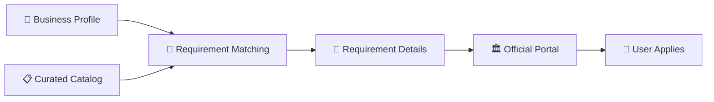
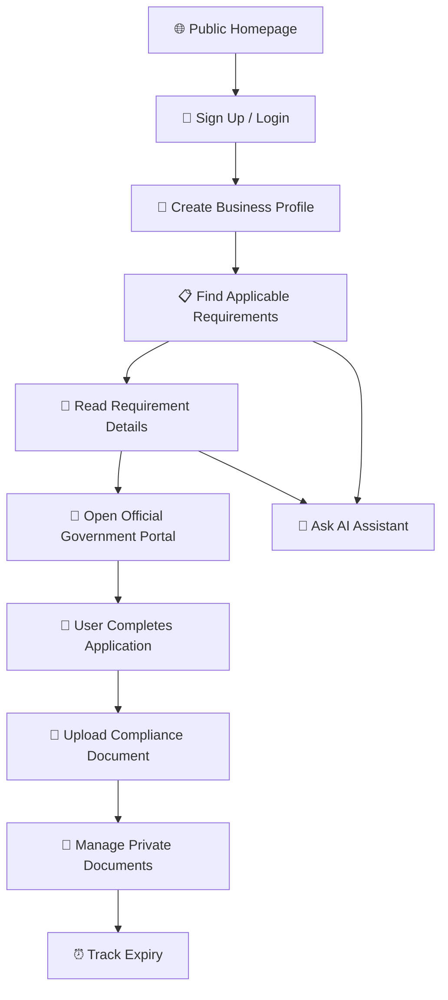
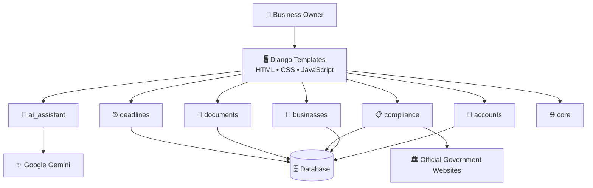

<!-- ========================================================= -->
<!--                  HEADER BANNER                            -->
<!-- ========================================================= -->

<p align="center">
  
</p>

<div align="center">

# 🏢 Small Business Compliance Assistant

### A modern workspace for small businesses to understand compliance, manage documents, and stay ahead of deadlines.

<br>

[](https://www.python.org/)
[](https://www.djangoproject.com/)
[](https://ai.google.dev/)
[](https://www.sqlite.org/)

<br>


</div>

---

# 💡 What is this?

Running a small business can involve licenses, registrations, certificates, documents, government portals, renewals, and deadlines.

The **Small Business Compliance Assistant** brings these pieces together into one organized workspace.

Instead of searching across different websites and trying to remember different deadlines, a business owner can use one platform to:

- 🏢 Create a business profile
- 📋 Discover applicable compliance requirements
- 📖 Understand requirements in simple language
- 📄 Manage compliance-related documents
- 🔗 Access official government portals
- ⏰ Track document expiry dates
- 🤖 Ask an AI assistant for explanations

> ⚠️ **Important:** The application does not submit government applications on behalf of users. Users complete applications themselves through the relevant official government portal.

---

# ✨ Core Features

<div align="center">

| 🤖 AI Assistant | 🏢 Business Profile | 📋 Compliance Matching |
|:---:|:---:|:---:|
| Gemini-powered explanations | Business information | Curated requirements |

| 🔗 Official Portals | 🔐 Document Vault | ⏰ Deadline Tracking |
|:---:|:---:|:---:|
| Verified external links | Private document management | Expiry monitoring |

</div>

---

## 🤖 AI Compliance Assistant

Users can ask questions about compliance in natural language.

The AI assistant can help with:

- Understanding compliance concepts
- Explaining complicated terminology
- Simplifying requirement descriptions
- Providing contextual explanations
- Guiding users toward official sources

The AI also reminds users to verify important legal or regulatory information using official sources.

### AI Architecture

```text
                👤 USER
                   │
                   ▼
          ┌─────────────────┐
          │   Django App    │
          └────────┬────────┘
                   │
                   ▼
          ┌─────────────────┐
          │  AI Assistant   │
          └────────┬────────┘
                   │
                   ▼
          ┌─────────────────┐
          │  Google Gemini  │
          └────────┬────────┘
                   │
                   ▼
          💬 Plain-language
             explanation
```

---

# 🏢 Business Profile

The application collects basic business information to understand which requirements may apply.

A profile can include:

- Business type
- Business activity
- Location
- Employee count
- Other relevant business information

This information is used to match the business with entries from the curated compliance catalog.

---

# 📋 Compliance Matching

One of the most important design decisions in this project is:

> ## **AI explains. Curated data defines.**

The AI should **not invent government requirements**.

Instead, requirements are maintained through a reviewed compliance catalog.

Each requirement can contain:

- Requirement name
- Description
- Business type
- Jurisdiction
- Applicability
- Required documents
- Application steps
- Official source
- Official application portal

### Workflow



---

# 🔗 Official Government Portals

The application provides links to relevant official portals.

The user remains responsible for completing the actual government application.

```text
Application
     │
     ▼
Requirement Details
     │
     ▼
Official Government Portal
     │
     ▼
User Completes Application
```

The application does **not** automatically submit government forms.

---

# 📄 Private Document Management

Users can upload documents associated with compliance requirements.

Each document may contain:

- Document file
- Requirement
- Issue date
- Expiry date
- Additional metadata

### Document ownership

```text
👤 User
   │
   ├── 📄 Document A
   ├── 📄 Document B
   └── 📄 Document C
```

Documents are intended to be accessible only to their owner.

---

# ⏰ Deadline Tracking

The deadline system helps users identify documents that require attention.

### Deadline groups

```text
🔴 EXPIRED
   │
   ▼
🟠 EXPIRING TODAY
   │
   ▼
🟡 EXPIRING WITHIN 10 DAYS
```

Documents without an expiry date are excluded from deadline-based groups.

---

# 🛡️ Security

Security is a core part of the project because users may upload sensitive business documents.

### Authentication

- Django authentication
- Login protection
- Signup validation
- Owner-based access control

### Document Security

- Owner-only document access
- Protected downloads
- File validation
- File-size limits
- Private storage strategy

### Application Security

- CSRF protection
- Environment variables for secrets
- Secure cookies in production
- HTTPS in production
- Restricted `ALLOWED_HOSTS`
- Production database
- Dependency updates
- Logging and monitoring

### Production Security Checklist

```text
[ ] DEBUG=False
[ ] Strong SECRET_KEY
[ ] HTTPS enabled
[ ] Secure cookies
[ ] Correct ALLOWED_HOSTS
[ ] File validation
[ ] Upload size limits
[ ] Private document storage
[ ] Production database
[ ] Database backups
[ ] Dependency updates
[ ] Error logging
[ ] Security monitoring
```

---

# 🎨 UI / UX Direction

The interface is designed around a modern SaaS-style experience.

### 🌙 Dark Mode

The default visual direction uses:

- Deep dark backgrounds
- Blue and purple accents
- Soft gradients
- Subtle borders
- Glass-style surfaces
- Smooth transitions

### ☀️ Light Mode

Users can switch to a cleaner light interface with:

- Bright backgrounds
- Soft surfaces
- Strong text contrast
- Blue/purple accent colors

### 🧊 Visual Style

The project can use subtle 3D-inspired elements such as:

- Floating document cards
- Layered dashboard panels
- Depth-based cards
- Soft shadows
- Glassmorphism
- Compliance illustrations
- Floating icons
- Smooth hover animations

The goal is:

> **Modern, clean, professional, and easy to use.**

---

# 🧭 Complete User Workflow



---

# 🏗️ System Architecture



---

# 🛠️ Technology Stack

| Layer | Technology |
|---|---|
| 🐍 Programming Language | Python 3.12+ |
| 🎯 Backend Framework | Django 6.1 |
| 🤖 AI | Google Gemini |
| 🔌 AI SDK | Google Gen AI SDK |
| 🗄️ Development Database | SQLite |
| 🎨 Frontend | HTML, CSS, JavaScript |
| 🔐 Authentication | Django Authentication |
| 📁 File Handling | Django File Storage |
| 🧪 Testing | Django Test Framework |

---

# 📁 Project Structure

```text
📦 Small Business Compliance Assistant
│
├── 🔐 accounts/
│   └── Authentication and account management
│
├── 🤖 ai_assistant/
│   └── Business workflow and AI responses
│
├── 🏢 businesses/
│   └── Business profiles
│
├── 📋 compliance/
│   └── Curated compliance requirements
│
├── 📄 documents/
│   └── Private document management
│
├── ⏰ deadlines/
│   └── Expiry and deadline tracking
│
├── 🌐 core/
│   └── Homepage and dashboard
│
├── 🎨 templates/
│   └── Django HTML templates
│
├── ⚡ static/
│   └── CSS and JavaScript
│
├── 📁 media/
│   └── Uploaded documents
│
├── ⚙️ manage.py
├── 📦 requirements.txt
├── 🔑 .env.example
├── 🚫 .gitignore
└── 📖 README.md
```

---

# 🚀 Quick Start

## 1. Clone the Repository

```bash
git clone https://github.com/your-username/your-repository.git
```

## 2. Enter the Project

```bash
cd your-repository
```

## 3. Create a Virtual Environment

### Windows

```powershell
py -3 -m venv .venv
```

Activate it:

```powershell
.\.venv\Scripts\Activate.ps1
```

### macOS / Linux

```bash
python3 -m venv .venv
source .venv/bin/activate
```

---

## 4. Install Dependencies

```bash
python -m pip install --upgrade pip
pip install -r requirements.txt
```

---

## 5. Configure Environment Variables

Create a `.env` file.

```env
SECRET_KEY=your-secret-key

DEBUG=True

ALLOWED_HOSTS=localhost,127.0.0.1

GEMINI_API_KEY=your-gemini-api-key

GEMINI_MODEL=gemini-2.5-flash
```

### 🔐 Never commit `.env`

```text
.env
```

should remain inside `.gitignore`.

---

## 6. Run Migrations

```bash
python manage.py migrate
```

---

## 7. Create an Admin Account

```bash
python manage.py createsuperuser
```

---

## 8. Start the Development Server

```bash
python manage.py runserver
```

Open:

```text
http://127.0.0.1:8000/
```

---

# 🚀 Render Deployment

The app uses SQLite locally unless `DATABASE_URL` is set. Render web-service filesystems are ephemeral, so SQLite user accounts can disappear after a restart or redeploy. Use a persistent Render PostgreSQL database in production:

1. Create a PostgreSQL database in Render.
2. In the web service's **Environment** settings, set `DATABASE_URL` to that database's **Internal Database URL**.
3. In the web service's **Environment** settings, add `ADMIN_USERNAME=aryan`, `ADMIN_EMAIL` with your email address, and `ADMIN_PASSWORD` with a strong, unique password. Do not use `1234`.
4. Deploy the service. The build runs migrations and creates the initial admin from these variables; it never resets an existing admin's password.
5. After a successful deployment, remove `ADMIN_PASSWORD` from the service's environment variables. Visit `https://<your-site>/admin/` and sign in with the username and password you configured.
6. Sign up again on the deployed site if your previous account was created in the service's temporary SQLite database. That old account is not automatically copied to PostgreSQL.

If the `aryan` admin already exists but its password is not accepted, set `ADMIN_USERNAME=aryan`, `ADMIN_EMAIL`, and a new strong `ADMIN_PASSWORD`, then set `ADMIN_RESET_PASSWORD=true` and redeploy. After the build succeeds, remove `ADMIN_PASSWORD` and `ADMIN_RESET_PASSWORD`.

Keep the PostgreSQL database (and its data) when redeploying the web service. Do not use the SQLite fallback for production.

---

# 🔑 Gemini Configuration

The project uses the **Google Gen AI SDK** to communicate with Gemini.

The API key should be stored inside an environment variable:

```env
GEMINI_API_KEY=your-api-key
```

Never place an API key directly inside Python source code.

Example:

```python
import os

from google import genai

api_key = os.getenv("GEMINI_API_KEY")

client = genai.Client(
    api_key=api_key
)
```

The model can be configured through:

```env
GEMINI_MODEL=gemini-2.5-flash
```

---

# 📋 Managing Compliance Requirements

Requirements can be maintained through Django Admin.

Start the development server:

```bash
python manage.py runserver
```

Open:

```text
http://127.0.0.1:8000/admin/
```

Requirements should be reviewed before being added to the catalog.

A requirement may include:

```text
Requirement
├── Name
├── Description
├── Business Type
├── Jurisdiction
├── Applicability
├── Required Documents
├── Steps
├── Official Source
└── Official Application Portal
```

### Important principle

If the application cannot identify a verified requirement, it should **not invent one**.

---

# 🧪 Testing

Run Django tests:

```bash
python manage.py test
```

Check migrations:

```bash
python manage.py makemigrations --check --dry-run
```

Apply migrations:

```bash
python manage.py migrate
```

Run Django system checks:

```bash
python manage.py check
```

---

# 🗺️ Development Roadmap

```text
                         🚀 PROJECT
                            │
                            ▼
                 ┌────────────────────┐
                 │     FOUNDATION     │
                 └─────────┬──────────┘
                           │
                  Authentication
                  Business Profile
                  Dashboard
                           │
                           ▼
                 ┌────────────────────┐
                 │     COMPLIANCE     │
                 └─────────┬──────────┘
                           │
                  Requirement Catalog
                  Matching System
                  Official Portals
                           │
                           ▼
                 ┌────────────────────┐
                 │     DOCUMENTS      │
                 └─────────┬──────────┘
                           │
                  Private Uploads
                  Metadata
                  Access Control
                           │
                           ▼
                 ┌────────────────────┐
                 │      DEADLINES     │
                 └─────────┬──────────┘
                           │
                  Expiry Tracking
                  Upcoming Alerts
                           │
                           ▼
                 ┌────────────────────┐
                 │     AI ASSISTANT   │
                 └─────────┬──────────┘
                           │
                  Gemini Integration
                  Contextual Answers
                  Plain-language Help
                           │
                           ▼
                 ┌────────────────────┐
                 │     PRODUCTION     │
                 └────────────────────┘
                           │
                  Security Hardening
                  Production Database
                  Cloud Storage
                  Deployment
```

---

# 🔮 Future Ideas

Possible future improvements include:

- 🔔 Email deadline reminders
- 📅 Calendar integration
- 📱 Progressive Web App
- 📊 Compliance analytics
- 📤 Compliance report generation
- 👥 Multi-user business accounts
- ☁️ Cloud document storage
- 🗺️ Multi-jurisdiction support
- 🔎 Advanced compliance search
- 🔐 Stronger production security
- 🧠 More contextual AI assistance
- 📈 Business compliance dashboard

---

# ⚠️ Disclaimer

The **Small Business Compliance Assistant** provides informational assistance and is not a substitute for professional legal advice.

Government requirements may vary depending on:

- Business type
- Location
- Industry
- Business activity
- Number of employees
- Revenue
- Registration status
- Current regulations

Requirements and government procedures can change over time.

Users should verify important information through the relevant official government authority or portal.

**This application does not submit government applications on behalf of users.**

---

# 👨‍💻 Project Philosophy

This project follows three simple principles:

```text
┌──────────────────────────────────────────┐
│                                          │
│        🤖 AI should explain              │
│                                          │
│        📋 Data should be verified        │
│                                          │
│        👤 Users should stay in control   │
│                                          │
└──────────────────────────────────────────┘
```

The goal is not to replace government websites or legal professionals.

The goal is to make the journey toward understanding and managing compliance simpler.

---

<br>

<div align="center">

### 🚀 Keep Building. Keep Learning. Keep Moving Forward.

**Every great product starts with one small step.**

<br>

⭐ **If you like this repository, a star would mean a lot to me.**

<br>


</div>