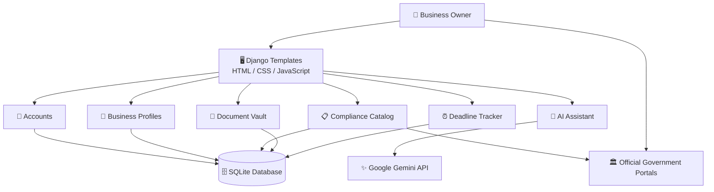
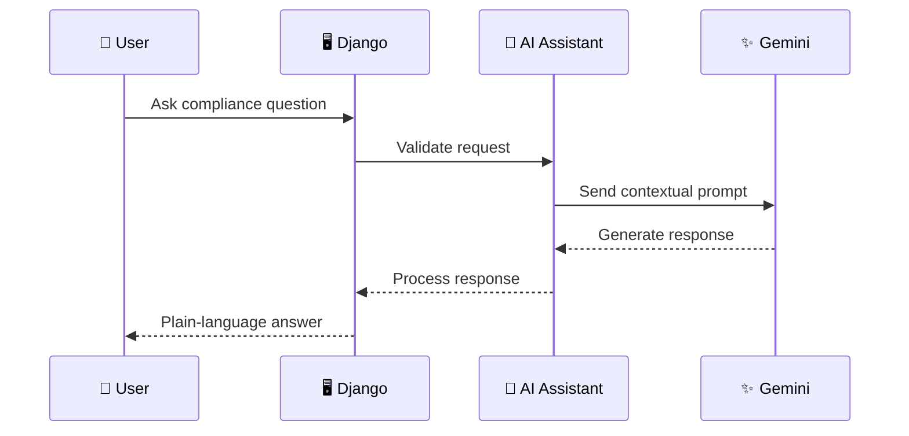
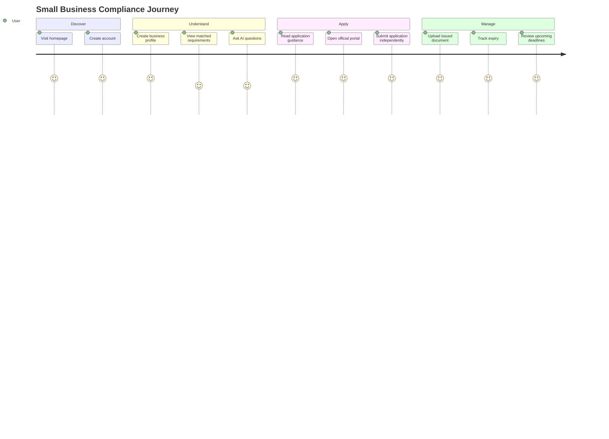

# 🏢 Small Business Compliance Assistant

<p align="center">

**Understand your compliance. Track your documents. Stay ahead of deadlines.**

A practical workspace that helps small businesses discover relevant compliance requirements, understand what they need, keep important documents organized, and access official government portals.

<br>


</p>

---

## 🌟 What is this?

Running a small business often means dealing with registrations, licenses, certificates, renewals, documents, deadlines, and government portals.

The **Small Business Compliance Assistant** brings these pieces together into one simple workspace.

Instead of trying to remember:

> "Which compliance applies to my business?"

> "What documents do I need?"

> "Where do I apply?"

> "When does my document expire?"

the application gives the business owner a structured place to find, understand, and track this information.

### 🎯 Core idea

```text
Business Profile
       ↓
Requirement Matching
       ↓
Understand the Requirement
       ↓
Visit Official Government Portal
       ↓
Apply Independently
       ↓
Upload Issued Document
       ↓
Track Expiry & Deadlines
```

> ⚠️ **Important:** The application does not submit government applications on behalf of users. Users always complete applications themselves on the relevant official government portal.

---

# ✨ Features

<table>
<tr>
<td width="50%">

### 🤖 AI Assistant

Ask questions about compliance in plain language.

- Gemini-powered responses
- Beginner-friendly explanations
- Context-aware business information
- Reminders to verify legal information
- Official-source verification guidance

</td>

<td width="50%">

### 🏢 Business Profile

Create a profile describing the business.

- Business type
- Business activity
- Location
- Employee count
- Other matching information

</td>
</tr>

<tr>
<td width="50%">

### 📋 Compliance Matching

Discover requirements from a curated catalog.

- Business-type matching
- Jurisdiction matching
- Requirement explanations
- Required documents
- Application guidance
- Official sources

</td>

<td width="50%">

### 🔗 Official Portals

Access the relevant government portal.

- Official source URLs
- Official application URLs
- Clear application guidance
- User-controlled submission

</td>
</tr>

<tr>
<td width="50%">

### 🔐 Private Document Vault

Keep compliance documents organized.

- Owner-only access
- Secure document handling
- Requirement-linked documents
- Issue dates
- Expiry dates
- Download and editing controls

</td>

<td width="50%">

### ⏰ Deadline Tracking

Never lose track of important expiry dates.

- Expired documents
- Documents expiring today
- Documents expiring within 10 days
- Clear deadline grouping
- Documents without expiry dates excluded

</td>
</tr>
</table>

---

# 🧭 How It Works

```mermaid
flowchart LR
    A["🌐 Public Homepage"] --> B["🔐 Sign Up / Login"]
    B --> C["🤖 AI Assistant"]
    C --> D["🏢 Business Profile"]
    D --> E["📋 Matched Requirements"]
    E --> F["📖 Requirement Details"]
    F --> G["🔗 Official Government Portal"]
    G --> H["👤 User Applies Independently"]
    H --> I["✅ I Applied Successfully"]
    I --> J["📄 Upload Document"]
    J --> K["🔐 Documents Vault"]
    K --> L["⏰ Expiry Tracking"]
```



---

# 🧠 System Architecture



---

# 🛡️ Security & Privacy

Security is treated as a core part of the project because compliance documents may contain sensitive business information.

### 🔒 Current protections

- Authentication required for private areas
- Owner-only document access
- Owner-only document editing
- Owner-only document downloads
- Environment variables for secrets
- API keys kept outside source code
- Django authentication and authorization
- Private document storage structure

### 🚧 Production security considerations

Before production deployment, the application should additionally use:

- HTTPS
- Secure cookies
- CSRF protection
- Strong production `SECRET_KEY`
- Restricted `ALLOWED_HOSTS`
- Secure file validation
- File-size limits
- Content-type validation
- Production-grade database
- Encrypted backups
- Secure object/file storage
- Logging and monitoring
- Rate limiting
- Regular dependency updates

> 🔐 Compliance documents should be treated as sensitive business data.

---

# 🤖 AI Architecture

The AI assistant uses **Google Gemini** through the Google Gen AI SDK.



### AI responsibility

The AI is intended to:

- Explain compliance concepts
- Simplify complicated language
- Help users understand requirements
- Guide users toward official sources
- Answer general compliance questions

### AI does NOT replace official sources

AI-generated answers should not be treated as legal advice.

The application encourages users to verify important information through the relevant government authority.

---

# 📋 Curated Compliance Catalog

One of the most important design decisions is separating **verified compliance data** from AI-generated content.

The application uses a `ComplianceRequirement` catalog.

```text
                    ┌───────────────────────────┐
                    │ ComplianceRequirement     │
                    ├───────────────────────────┤
                    │ Business Type             │
                    │ Jurisdiction              │
                    │ Summary                   │
                    │ Documents Required        │
                    │ Application Guidance      │
                    │ Official Source URL       │
                    │ Official Portal URL       │
                    └─────────────┬─────────────┘
                                  │
                                  ▼
                       Business Profile Match
                                  │
                                  ▼
                         Relevant Requirements
```

This architecture helps prevent the AI from inventing government requirements or portal URLs.

### Adding requirements

1. Start the Django application.
2. Sign in to the Django admin.
3. Open:

```text
/admin/
```

4. Add reviewed compliance requirements.
5. Provide the correct business type and jurisdiction.
6. Add verified official sources.
7. Add the official application portal.
8. Save the requirement.

Only verified information should be added to the catalog.

---

# 📄 Document Management

Documents are connected to the user's requirements.

```text
Requirement
     │
     ├── Required Documents
     │
     └── Issued Document
              │
              ├── Issue Date
              ├── Expiry Date
              ├── Owner
              └── File
```

Documents are stored under:

```text
media/private_documents/
```

The application restricts document access to the owner.

---

# ⏰ Deadline System

The deadline system groups documents according to their expiry date.

### 🔴 Expired / Today

Documents with an expiry date:

```text
≤ Today
```

### 🟠 Expiring Soon

Documents expiring:

```text
Tomorrow → Next 10 Days
```

### ⚪ No Expiry

Documents without an expiry date are not shown in the expiry groups.

This creates a simple "what needs attention?" view instead of forcing users to search through every document.

---

# 🛠️ Technology Stack

| Technology | Purpose |
|---|---|
| 🐍 Python | Backend programming |
| 🎯 Django 6.1 | Web framework |
| 🧠 Google Gen AI SDK | Gemini integration |
| ✨ Gemini | AI responses |
| 🗄️ SQLite | Default development database |
| 🎨 HTML/CSS | User interface |
| ⚡ JavaScript | Client-side interactions |
| 🔐 Django Auth | Authentication |
| 📁 Django File Handling | Document management |

---

# 📁 Project Structure

```text
small-business-compliance-assistant/
│
├── accounts/
│   └── 🔐 Authentication & account creation
│
├── ai_assistant/
│   └── 🤖 Business profile workflow & AI responses
│
├── businesses/
│   └── 🏢 User business profiles
│
├── compliance/
│   └── 📋 Curated compliance requirements
│
├── documents/
│   └── 📄 Private uploads & document management
│
├── deadlines/
│   └── ⏰ Expiry tracking
│
├── core/
│   └── 🌐 Homepage & dashboard
│
├── templates/
│   └── 🎨 Django HTML templates
│
├── static/
│   └── ⚡ CSS & JavaScript
│
├── media/
│   └── 📁 User-uploaded documents
│
├── manage.py
├── requirements.txt
├── .env.example
├── .gitignore
└── README.md
```

---

# 🚀 Quick Start

## Windows PowerShell

```powershell
py -3 -m venv .venv

.\.venv\Scripts\Activate.ps1

python -m pip install --upgrade pip

pip install -r requirements.txt

Copy-Item .env.example .env

python manage.py migrate

python manage.py createsuperuser

python manage.py runserver
```

Open:

```text
http://127.0.0.1:8000/
```

---

## macOS / Linux

```bash
python3 -m venv .venv

source .venv/bin/activate

python -m pip install --upgrade pip

pip install -r requirements.txt

cp .env.example .env

python manage.py migrate

python manage.py createsuperuser

python manage.py runserver
```

Open:

```text
http://127.0.0.1:8000/
```

---

# ⚙️ Environment Configuration

Create a local `.env` file:

```env
SECRET_KEY=your-secret-key
DEBUG=True
ALLOWED_HOSTS=localhost,127.0.0.1

GEMINI_API_KEY=your-gemini-api-key
GEMINI_MODEL=gemini-2.5-flash
```

### Environment variables

| Variable | Purpose | Default |
|---|---|---|
| `SECRET_KEY` | Django signing key | Development-only key |
| `DEBUG` | Django debug mode | `True` |
| `ALLOWED_HOSTS` | Allowed host names | `localhost,127.0.0.1` |
| `GEMINI_API_KEY` | Gemini API authentication | Empty |
| `GEMINI_MODEL` | Gemini model | `gemini-2.5-flash` |

> 🚨 **Never commit `.env` or production secrets to GitHub.**

---

# 🧪 Testing

Run Django's test suite:

```powershell
python manage.py test
```

Check whether model changes require migrations:

```powershell
python manage.py makemigrations --check --dry-run
```

Apply migrations:

```powershell
python manage.py migrate
```

---

# 🎨 UI Philosophy

The interface is designed around three principles:

### 🌙 Dark First

A modern dark interface provides a focused workspace for business owners.

### ☀️ Light Mode

Users can switch to a clean light interface when preferred.

### ✨ Motion With Purpose

Animations should support usability rather than distract from it.

Recommended interface effects include:

```text
Hover
  ↓
Smooth elevation
  ↓
Soft shadow
  ↓
Small transform
  ↓
Interactive feedback
```

Potential visual elements:

- Glassmorphism cards
- Soft gradients
- Floating background shapes
- Animated dashboard statistics
- Smooth page transitions
- Micro-interactions
- 3D-style icons
- Depth-based cards
- Animated compliance status indicators

> 💡 The README itself cannot safely execute arbitrary CSS/JavaScript animations. Those effects belong in the actual Django frontend.

---

# 🧊 3D / Visual Direction

The application can use subtle 3D-inspired elements without turning the interface into a visual carnival.

Possible elements:

```text
             ╭───────────────╮
            ╱               ╱│
           ╱   COMPLIANCE  ╱ │
          ╱      ✓        ╱  │
         ╰───────────────╯   │
         │               │   ╱
         │   DOCUMENTS   │  ╱
         │      📄       │ ╱
         ╰───────────────╯
```

Recommended 3D concepts:

- Floating document cards
- Isometric compliance dashboard
- 3D shield/security element
- Floating deadline calendar
- Layered requirement cards
- Subtle depth effects

Keep 3D elements decorative and lightweight so the application remains fast and professional.

---

# 🔄 User Journey



---

# 🔐 Security Checklist

Before production:

- [ ] `DEBUG=False`
- [ ] Strong production `SECRET_KEY`
- [ ] HTTPS enabled
- [ ] Secure cookies enabled
- [ ] Production database configured
- [ ] File upload validation enabled
- [ ] File size limits configured
- [ ] Private document storage configured
- [ ] API keys stored in environment variables
- [ ] `.env` excluded from Git
- [ ] Database backups configured
- [ ] Dependency updates monitored
- [ ] Authentication tested
- [ ] Authorization tested
- [ ] CSRF protection verified
- [ ] Production `ALLOWED_HOSTS` configured
- [ ] Error pages configured
- [ ] Logging and monitoring configured

---

# ⚠️ Important Disclaimer

This application provides **informational compliance assistance**.

It does not provide legal advice.

Government requirements can change, and applicability can depend on factors such as:

- Business type
- Location
- Industry
- Business activity
- Number of employees
- Revenue
- Registration status
- Current government rules

Users should verify important requirements with the relevant government authority.

The application does **not** submit government applications on behalf of users.

---

# 🗺️ Project Roadmap

```text
✅ Project foundation
       │
       ▼
✅ Authentication
       │
       ▼
✅ Business profile
       │
       ▼
✅ Compliance catalog
       │
       ▼
✅ Requirement matching
       │
       ▼
✅ Document vault
       │
       ▼
✅ Deadline tracking
       │
       ▼
🚧 Gemini AI assistant
       │
       ▼
🚧 UI polish & animations
       │
       ▼
🚧 Production security hardening
       │
       ▼
🚧 Deployment
```

---

# 💡 Future Possibilities

Potential future improvements include:

- 📧 Email deadline reminders
- 🔔 Browser notifications
- 📱 Mobile-friendly PWA experience
- 📊 Compliance dashboard
- 🧾 More document types
- 🔍 Advanced requirement filtering
- 🗺️ More jurisdiction support
- 👥 Multi-user business accounts
- 📈 Compliance history
- 📤 Exportable compliance reports
- 🔐 Stronger production document encryption
- ☁️ Cloud object storage
- 🧠 More contextual AI assistance

---

# 🤝 Contributing

Contributions, suggestions, and improvements are welcome.

A typical development workflow:

```bash
git checkout -b feature/my-feature

git add .

git commit -m "Add my feature"

git push origin feature/my-feature
```

Then open a Pull Request.

---

# 📜 License

Add your preferred license here before making the project public.

---

<p align="center">

### 🏢 Built to make compliance less confusing.

**Understand → Apply → Organize → Track**

<br>

⭐ If you find the project interesting, consider giving it a star.

</p>